# Basic Snippets

## 1-example

### HTML COde

```html

<!DOCTYPE html>

<html>

	<head>
		
		<meta charset="utf-8">
		<title>This is Angular JS</title>
		
	</head>

	<body>

		<div ng-app="">
			
			<input type="text" ng-model="name">
			<h1 ng-bind="name"><h1>

		</div>

		
		<script src="https://ajax.googleapis.com/ajax/libs/angularjs/1.5.6/angular.min.js"></script>

	
	</body>


</html>


```

### Output

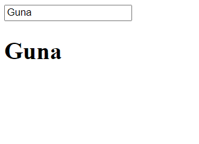

## 02-expressions

### HTML Code

```html

<!DOCTYPE html>

<html ng-app>

	<head>
		
		<meta charset="utf-8">
		<title>This is Angular JS</title>
		
	</head>

	<body>

		<div>
			
			Boolean:{{1==1}}
			
		</div>
		<div>
			
			{{['kuna','joker','hacker'][2]}}

		</div>
		
		<div>
			
			{{28+2}}

		</div>

		
		<script src="https://ajax.googleapis.com/ajax/libs/angularjs/1.5.6/angular.min.js"></script>

	
	</body>


</html>

```

### Output

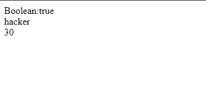

## 03-module

### HTML Code

```html

<!DOCTYPE html>

<html ng-app="myModule">

	<head>
		
		<meta charset="utf-8">
		<title>This is Angular JS</title>
		
	</head>

	<body ng-controller="myController">


			{{message}}
		
		<script src="https://ajax.googleapis.com/ajax/libs/angularjs/1.5.6/angular.min.js"></script>
		<script type="text/javascript" src="scripts.js"></script>

	
	</body>


</html>

```

### Java Scripts Code

```Java Scripts

var myApp = angular.module("myModule",[]);

myApp.controller("myController",function($scope){

	$scope.message = "This is Joker Hacker";

});

```

### Output

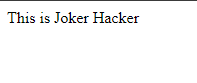

## 04-controller

### HTML Code

```html

<!DOCTYPE html>

<html ng-app="myModule">

	<head>
		
		<meta charset="utf-8">
		<title>This is Angular JS</title>
		
	</head>

	<body>

		<div ng-controller="myController">


		<h1>Firstname: {{emp.firstname}}</h1>
		<h1>Lastname: {{emp.lastname}}</h1>
		<h1>gender: {{emp.gender}}</h1>

		</div>
		
		<script src="https://ajax.googleapis.com/ajax/libs/angularjs/1.5.6/angular.min.js"></script>
		<script type="text/javascript" src="scripts.js"></script>

	
	</body>


</html>

```

### Java Scripts Code

```Java Scripts

var app = angular
			.module("myModule",[])
			.controller("myController",function($scope){

				var employee={

						firstname:"Guna",
						lastname:"Rakulan",
						gender:"male"

				}

				$scope.emp=employee;


			});


/*

	This is called chining method.
	We have joined the module and the controller at once.


*/


```

### Output

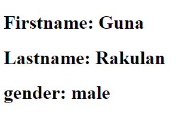

## 05-ng-src

### HTML Code

```html

<!DOCTYPE html>

<html ng-app="myModule">

	<head>
		
		<meta charset="utf-8">
		<title>This is Angular JS</title>
		
	</head>

	<body>

		
		<div ng-controller="myController">

			<h2>{{usaData.country}}</h2>
			<h2>{{usaData.capital}}</h2>
			<h2>{{usaData.fileSrc}}</h2>
			
			<!--
			
			01.ng-src will work perfectly. 
			02. src will return a error at first time.

			--->


		</div>
		
		<script src="https://ajax.googleapis.com/ajax/libs/angularjs/1.5.6/angular.js"></script>
		<script type="text/javascript" src="scripts.js"></script>

	
	</body>


</html>

```

### Java Scripts Code

```Java Scripts

var app=angular.module("myModule",[]);
app.controller("myController",function($scope){
	
		var usa={

			country:"USA",
			capital:"Newyork",
		 	fileSrc:"usa.png"
		}

		$scope.usaData = usa;

});

```

### Output

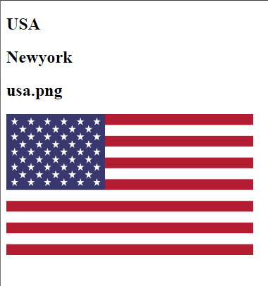


## 06-filters

### HTML Code

```html

<!DOCTYPE html>

<html ng-app="myModule">

	<head>
		
		<meta charset="utf-8">
		<title>This is Angular JS</title>
		
	</head>

	<body>

		
		<div ng-controller="myController">

		<input type="number" step="1" min="0" max="10" ng-model="numberOfElement">

			<table>
				
					<thead>
						
						<tr>
							
							<th>Name</th>
							<th>Date Of Birth</th>
							<th>Gender</th>
							<th>Salary</th>
							<th>Salary</th>

						</tr>

					</thead>

					<tbody>
						
						<tr ng-repeat="e in employee | limitTo:numberOfElement:1">
						<!--limitTo function limits the elements-->
						<!--:1 says start at 2-->

							<td>{{e.name | uppercase}}</td> <!--This filters to uppercase-->
							<td>{{e.dateOfBirth |date:"dd/mm/yyyy"}}</td><!-- custom date formet-->
							<td>{{e.gender | lowercase}}</td>
							<td>{{e.salary | number:2}}</td>
							<td>{{e.salary | currency:"$"}}</td>
							
						</tr>

					</tbody>
			</table>

		</div>
		
		<script src="https://ajax.googleapis.com/ajax/libs/angularjs/1.5.6/angular.js"></script>
		<script type="text/javascript" src="scripts.js"></script>

	
	</body>


</html>

```

### Java Scripts Code

```Java Scripts

var app=angular.module("myModule",[]);
	
app.controller("myController",function($scope){

	var employees = [

		{name:"joker",dateOfBirth:new Date("November 23,1980"),gender:"Male",salary:2200.780},
		{name:"hacker",dateOfBirth:new Date("May 05,1997"),gender:"Female",salary:32489.420},
		{name:"maker",dateOfBirth:new Date("August 10,1976"),gender:"Male",salary:2200.780},
		{name:"Kuna",dateOfBirth:new Date("October 27,1990"),gender:"Female",salary:1000.780},
		{name:"joker",dateOfBirth:new Date("November 23,1980"),gender:"Male",salary:2200.780},

	] 

	$scope.employee = employees;
	$scope.numberOfElement=3;

});

```

### Output

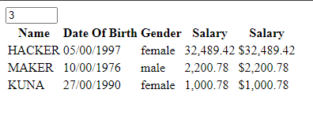

## 07-sorting

### HTML Code

```html

<!DOCTYPE html>

<html ng-app="myModule">

	<head>
		
		<meta charset="utf-8">
		<title>This is Angular JS</title>
		
	</head>

	<body>

		
		<div ng-controller="myController">

		<select ng-model="sortC">
			
			<option value="name">Name ASC</option>
			<option value="dateOfBirth">DOB ASC</option>
			<option value="gender">Gender ASC</option>
			<option value="-salary">Salary DES</option>

		</select>

			<table>	
					<thead>
						
						<tr>
							
							<th>Name</th>
							<th>Date Of Birth</th>
							<th>Gender</th>
							<th>Salary</th>
							<th>Salary</th>

						</tr>

					</thead>

					<tbody>
						
						<tr ng-repeat="e in employee | orderBy: sortC">

							<!--orderBy:'name':false means ASC ordering-->
							<!--orderBy:'name':true means DSE ordering-->
							<!--orderBy:'-name' DSE ordering-->
							<!--orderBy:'+name' ASC ordering-->

							<td>{{e.name | uppercase}}</td> 
							<td>{{e.dateOfBirth |date:"dd/mm/yyyy"}}</td>
							<td>{{e.gender | lowercase}}</td>
							<td>{{e.salary | number:2}}</td>
							<td>{{e.salary | currency:"$"}}</td>
							
						</tr>

					</tbody>
			</table>

		</div>
		
		<script src="https://ajax.googleapis.com/ajax/libs/angularjs/1.5.6/angular.js"></script>
		<script type="text/javascript" src="scripts.js"></script>

	
	</body>


</html>

```

### Java Scripts Code

```Java Scripts

var app=angular.module("myModule",[]);
	
app.controller("myController",function($scope){

	var employees = [

		{name:"joker",dateOfBirth:new Date("November 23,1980"),gender:"Male",salary:2200.780},
		{name:"hacker",dateOfBirth:new Date("May 05,1997"),gender:"Female",salary:32489.420},
		{name:"maker",dateOfBirth:new Date("August 10,1976"),gender:"Male",salary:2200.780},
		{name:"Kuna",dateOfBirth:new Date("October 27,1990"),gender:"Female",salary:1000.780},
		{name:"joker",dateOfBirth:new Date("November 23,1980"),gender:"Male",salary:2200.780},

	] 

	$scope.employee = employees;
	$scope.sortC = "name";

});

```
### Output

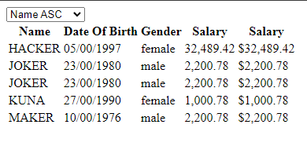

## 09-exect-match

### HTML Code

```html

<!DOCTYPE html>

<html ng-app="myModule">

	<head>
		
		<meta charset="utf-8">
		<title>This is Angular JS</title>
		<link rel="stylesheet" type="text/css" href="style.css">
		
	</head>

	<body>

		
		<div ng-controller="myController">

			<input type="text" placeholder="Search" ng-model='searchText.name' name="">
			<input type="text" ng-model='searchText.gender'>
			<input type="checkbox" ng-model="exMatch">

			
			<br>
			<br>

			<table>	
					<thead>
						
						<tr>
							<th>Name</th>
							<th>Date Of Birth</th>
							<th>Gender</th>
							<th>Salary</th>
							<th>Salary</th>

						</tr>

					</thead>

					<tbody>
						
						<tr ng-repeat="e in employee | filter:searchText:exMatch">

							<!--orderBy:'name':false means ASC ordering-->
							<!--orderBy:'name':true means DSE ordering-->
							<!--orderBy:'-name' DSE ordering-->
							<!--orderBy:'+name' ASC ordering-->

							<td>{{e.name | uppercase}}</td> 
							<td>{{e.dateOfBirth |date:"dd/mm/yyyy"}}</td>
							<td>{{e.gender | lowercase}}</td>
							<td>{{e.salary | number:2}}</td>
							<td>{{e.salary | currency:"$"}}</td>
							
						</tr>

					</tbody>
			</table>

		</div>
		
		<script src="https://ajax.googleapis.com/ajax/libs/angularjs/1.5.6/angular.js"></script>
		<script type="text/javascript" src="scripts.js"></script>

	
	</body>


</html>

```

### CSS Code

```css

.arrow-up{

	width: 0;
	height: 0;
	border-left: 5px solid transparent;
	border-right: 5px solid transparent;
	border-bottom:10px solid black;

}

.arrow-down{

width:0;
height: 0;
border-left: 5px solid transparent;
border-right: 5px solid transparent;
border-top: 10px solid black;


}

```
### Java Scripts Code

```Java Scripts

var app=angular.module("myModule",[]);
	
app.controller("myController",function($scope){

	var employees = [

		{name:"joker",dateOfBirth:new Date("November 23,1980"),gender:"Male",salary:2200.780},
		{name:"hacker",dateOfBirth:new Date("May 05,1997"),gender:"Female",salary:32489.420},
		{name:"maker",dateOfBirth:new Date("August 10,1976"),gender:"Male",salary:2200.780},
		{name:"Kuna",dateOfBirth:new Date("October 27,1990"),gender:"Female",salary:1000.780},
		{name:"joker",dateOfBirth:new Date("November 23,1980"),gender:"Male",salary:2200.780},

	] 

	$scope.employee = employees;
	

});

```
### Output

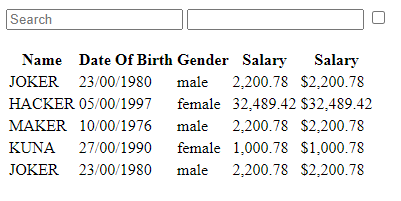


## 10-customer-filter

### HTML Code

```html

<!DOCTYPE html>

<html ng-app="myModule">

	<head>
		
		<meta charset="utf-8">
		<title>This is Angular JS</title>
		<link rel="stylesheet" type="text/css" href="style.css">
		
	</head>

	<body>

		
		<div ng-controller="myController">

			
			<table>
				
				<thead>
					
					<tr>
						
						<th>Name</th>
						<th>Gender</th>
						<th>Salary</th>

					</tr>

				</thead>

				<tbody>
					
						<tr ng-repeat="emp in employees">
							
							<td>{{emp.name}}</td>
							<td>{{emp.gender |gender}}</td> <!--| gender means assigned that gender filter-->
							<td>{{emp.salary}}</td>

						</tr>

				</tbody>


			</table>

			
		</div>
		
		<script src="https://ajax.googleapis.com/ajax/libs/angularjs/1.5.6/angular.js"></script>
		<script type="text/javascript" src="scripts.js"></script>
		<script type="text/javascript" src="filter.js"></script>

	
	</body>


</html>

```

### Java Scripts Code

```Java Scripts

app.filter("gender",function(){

	return function(gender){

		switch(gender){

			case 1:
				return "Male";

			case 2:
				return "Female";
		}


	}


});

```

```Java Scripts

var app = angular.module("myModule",[]);
app.controller("myController",function($scope){

	var employees = [

			{name:"Ben",gender:1,salary:5500},
			{name:"joker",gender:2,salary:3200},
			{name:"maker",gender:2,salary:5400},
			{name:"Doer",gender:1,salary:3200},
			{name:"hacker",gender:2,salary:5400},
			{name:"gta",gender:2,salary:4300},
			{name:"guna",gender:1,salary:3300}


	];

	$scope.employees = employees;

});

```

### Output

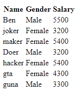

## 11-ng-hide

### HTML Code

```html

<!DOCTYPE html>

<html ng-app="myModule">

	<head>
		
		<meta charset="utf-8">
		<title>This is Angular JS</title>
		<link rel="stylesheet" type="text/css" href="style.css">
		
	</head>

	<body>

		
		<div ng-controller="myController">

			<input type="checkbox" ng-model="hideSalary" name="">
			<!--This returns true or false-->
			
			<table>
				
				<thead>
					
					<tr>
						
						<th>Name</th>
						<th>Gender</th>
						<th ng-hide="hideSalary">Salary</th>
						<!--ng-hide method hides the element when it is true-->

					</tr>

				</thead>

				<tbody>
					
						<tr ng-repeat="emp in employees">
							
							<td>{{emp.name}}</td>
							<td>{{emp.gender}}</td> 
							<td ng-hide="hideSalary">{{emp.salary}}</td>

						</tr>

				</tbody>


			</table>

			
		</div>
		
		<script src="https://ajax.googleapis.com/ajax/libs/angularjs/1.5.6/angular.js"></script>
		<script type="text/javascript" src="scripts.js"></script>
		<script type="text/javascript" src="filter.js"></script>

	
	</body>


</html>

```

### Java Scripts Code

```Java Scripts

var app = angular.module("myModule",[]);
app.controller("myController",function($scope){

	var employees = [

			{name:"Ben",gender:"male",salary:5500},
			{name:"joker",gender:"female",salary:3200},
			{name:"maker",gender:"male",salary:5400},
			{name:"Doer",gender:"male",salary:3200},
			{name:"hacker",gender:"female",salary:5400},
			{name:"gta",gender:"male",salary:4300},
			{name:"guna",gender:"male",salary:3300}


	];

	$scope.employees = employees;

});

```

### Output

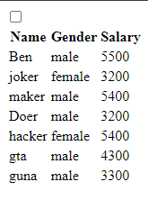

## 12-ng-show

### HTML Code

```html

<!DOCTYPE html>

<html ng-app="myModule">

	<head>
		
		<meta charset="utf-8">
		<title>This is Angular JS</title>
		<link rel="stylesheet" type="text/css" href="style.css">
		
	</head>

	<body>

		
		<div ng-controller="myController">

			<input type="checkbox" ng-model="hideSalary" name="">
			<!--This returns true or false-->
			
			<table>
				
				<thead>
					
					<tr>
						
						<th>Name</th>
						<th>Gender</th>
						<th ng-show="!hideSalary">Salary</th>
						<!--ng-show method shows the element when it is true-->
						<!--!hideSalary not-->

					</tr>

				</thead>

				<tbody>
					
						<tr ng-repeat="emp in employees">
							
							<td>{{emp.name}}</td>
							<td>{{emp.gender}}</td> 
							<td ng-show="!hideSalary">{{emp.salary}}</td>

						</tr>

				</tbody>


			</table>

			
		</div>
		
		<script src="https://ajax.googleapis.com/ajax/libs/angularjs/1.5.6/angular.js"></script>
		<script type="text/javascript" src="scripts.js"></script>
		<script type="text/javascript" src="filter.js"></script>

	
	</body>


</html>

```


### Java Scripts Code

```Java Scripts


var app = angular.module("myModule",[]);
app.controller("myController",function($scope){

	var employees = [

			{name:"Ben",gender:"male",salary:5500},
			{name:"joker",gender:"female",salary:3200},
			{name:"maker",gender:"male",salary:5400},
			{name:"Doer",gender:"male",salary:3200},
			{name:"hacker",gender:"female",salary:5400},
			{name:"gta",gender:"male",salary:4300},
			{name:"guna",gender:"male",salary:3300}


	];

	$scope.employees = employees;

});

```

### Output

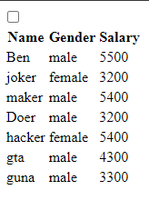


## 13-hide-and-show

### HTML Code

```html

<!DOCTYPE html>

<html ng-app="myModule">

	<head>
		
		<meta charset="utf-8">
		<title>This is Angular JS</title>
		<link rel="stylesheet" type="text/css" href="style.css">
		
	</head>

	<body>

		
		<div ng-controller="myController">

			<input type="checkbox" ng-model="hideSalary" name="">
			<!--This returns true or false-->
			
			<table>
				
				<thead>
					
					<tr>
						
						<th>Name</th>
						<th>Gender</th>
						<th ng-hide="hideSalary">Salary</th>
						<th ng-show="hideSalary">Salary</th>

						<!--
							When it turns true
							ng-hide will hide the salary.
							but ng-show will show the salary
						-->


					</tr>

				</thead>

				<tbody>
					
						<tr ng-repeat="emp in employees">
							
							<td>{{emp.name}}</td>
							<td>{{emp.gender}}</td> 
							<td ng-hide="hideSalary">{{emp.salary}}</td>
							<td ng-show="hideSalary">#####</td>

								<!--
							When it turns true
							ng-hide will hide the salary colunms.
							but ng-show will show the #####
						-->

						</tr>

				</tbody>


			</table>

			
		</div>
		
		<script src="https://ajax.googleapis.com/ajax/libs/angularjs/1.5.6/angular.js"></script>
		<script type="text/javascript" src="scripts.js"></script>
		<script type="text/javascript" src="filter.js"></script>

	
	</body>


</html>

```


### Java Scripts Code

```Java Scripts

var app = angular.module("myModule",[]);
app.controller("myController",function($scope){

	var employees = [

			{name:"Ben",gender:"male",salary:5500},
			{name:"joker",gender:"female",salary:3200},
			{name:"maker",gender:"male",salary:5400},
			{name:"Doer",gender:"male",salary:3200},
			{name:"hacker",gender:"female",salary:5400},
			{name:"gta",gender:"male",salary:4300},
			{name:"guna",gender:"male",salary:3300}


	];

	$scope.employees = employees;

});


```

### Output

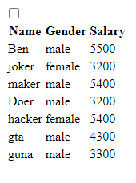

## 14-ng-include

### HTML Code

```html

<ul ng-repeat="emp in employees">
	
	<li>

		{{emp.name}}
		<ul>
		
			<li>

				{{emp.gender}}

			<li>

			<li>
				
				{{emp.salary}}

			</li>

		</ul>
	<li>

</ul>

```


```html

<!DOCTYPE html>

<html ng-app="myModule">

	<head>
		
		<meta charset="utf-8">
		<title>This is Angular JS</title>
		<link rel="stylesheet" type="text/css" href="style.css">
		
	</head>

	<body>

		
		<div ng-controller="myController">

			<select ng-model="employeeView">
			
				<option value="tablePrinter.html">Table</option>
				<option value="empList.html">List</option>	


			</select>

			<div ng-include="employeeView"></div>
			
		</div>
		
		<script src="https://ajax.googleapis.com/ajax/libs/angularjs/1.5.6/angular.js"></script>
		<script type="text/javascript" src="scripts.js"></script>
	
	</body>

</html>

```


```html

<table>
	
		<thead>
			
			<tr>
				
					<th>Name</th>
					<th>Gender</th>
					<th>Salary</th>

			</tr>

		</thead>

		<tbody>
			
			<tr ng-repeat="emp in employees">
				
					<td>{{emp.name}}</td>
					<td>{{emp.gender}}<td>
					<td>{{emp.salary}}<td>

			</tr>

		</tbody>

</table>

```


### Java Scripts Code

```Java Scripts

var app = angular.module("myModule",[]);
app.controller("myController",function($scope){

	var employees = [

			{name:"Ben",gender:"male",salary:5500},
			{name:"joker",gender:"female",salary:3200},
			{name:"maker",gender:"male",salary:5400},
			{name:"Doer",gender:"male",salary:3200},
			{name:"hacker",gender:"female",salary:5400},
			{name:"gta",gender:"male",salary:4300},
			{name:"guna",gender:"male",salary:3300}


	];

	$scope.employees = employees;
	$scope.employeeView = "tablePrinter.html";

});

```

### Output

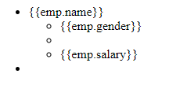
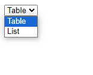
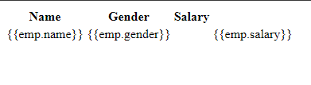


