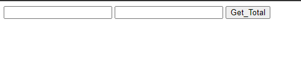
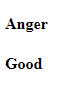
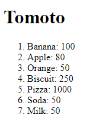
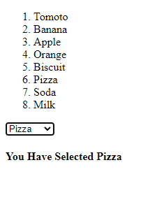

# Derek-beans Snippets

## 01-simple-addition-app

### HTML Code

```html

<!DOCTYPE html>

<html ng-app="">

	<head>
		
		<meta charset="utf-8">
		<title>This is Angular JS</title>
		
	</head>

	<body>


		<div ng-controller="ctrl1">
			
			<input type="text" ng-model="first">
			<input type="text" ng-model="second">
			<input type="button" ng-click="calculateFunction()" value="Get_Total">

			<h3 id="display" style="display: none">The Total is: {{total}}</h3>

		</div>
		
		
		<script src="https://ajax.googleapis.com/ajax/libs/angularjs/1.5.6/angular.js"></script>
		<script type="text/javascript" src="scripts.js"></script>

	
	</body>


</html>

```


### Java Scripts Code

```Java Scripts

var app=angular.module("app1",[]);

app.controller("ctrl1",function($scope){


	$scope.first=0;
	$scope.second=0;

	$scope.calculateFunction=function(){

		$scope.total = $scope.first + " + " + $scope.second + " = " + (+$scope.first + +$scope.second);
		document.getElementById("display").style.display="block";
	}


});


```

### Output



## 02-random-number

### HTML Code

```html

<!DOCTYPE html>

<html ng-app="app1">

	<head>
		
		<meta charset="utf-8">
		<title>This is Angular JS</title>
		
	</head>

	<body>


		<div ng-controller="ctrl1">
			
				<h3>The Random Number is {{randnum1}}</h3>
				<h3>The Random Number is {{randnum2}}</h3>


		</div>
		
		
		<script src="https://ajax.googleapis.com/ajax/libs/angularjs/1.5.6/angular.js"></script>
		<script type="text/javascript" src="scripts.js"></script>

	
	</body>


</html>

```


### Java Scripts Code

```Java Scripts

var app=angular.module("app1",[]);

app.controller("ctrl1",function($scope){

	$scope.randnum1 = Math.floor((Math.random() * 10) +1);
	$scope.randnum2 = Math.floor((Math.random() * 10) +1);


});


```

### Output


## 03-random-number-with-feelings

### HTML Code

```html

<!DOCTYPE html>

<html ng-app="app1">

	<head>
		
		<meta charset="utf-8">
		<title>This is Angular JS</title>
		
	</head>

	<body>


		<div ng-controller="badFeeling">
			
			<h4>{{feelingBad}}</h4>

		</div>
	
		<div ng-controller="goodFeeling">

			<h4>{{feelingGood}}</h4>

		</div>
		
		<script src="https://ajax.googleapis.com/ajax/libs/angularjs/1.5.6/angular.js"></script>
		<script type="text/javascript" src="scripts.js"></script>

	
	</body>


</html>

```


### Java Scripts Code

```Java Scripts

var app1 = angular.module("app1",[]);

app1.controller("badFeeling",function($scope){

	var randNum = Math.floor((Math.random()*4));
	var badFeelingArr = ["Fear","Anger","Sadness","Disgust"];

	$scope.feelingBad = badFeelingArr[randNum];

});

app1.controller("goodFeeling",function($scope){

	var randNum=Math.floor((Math.random())*4);
	var goodFeelingArr=["joy","happy","surprice","Good"];
	$scope.feelingGood = goodFeelingArr[randNum];

});


```

### Output




## 04-grocery-list

### HTML Code

```html

<!DOCTYPE html>

<html ng-app="app1">

	<head>
		
		<meta charset="utf-8">
		<title>This is Angular JS</title>
		
	</head>

	<body>

		<div ng-controller="ctrl1">
			
			<h1>{{groceryItems[0].item}}</h1> <!--Access single data-->

			<ol>

					<li ng-repeat="gor in groceryItems" ng-if="$index > 0">{{gor.item}}: {{gor.Price}}</li>

					<!--
						
						ng-if="$index > 0"
						Means start from greter then 0 means 1.

					-->

			</ol>

		</div>


		<script src="https://ajax.googleapis.com/ajax/libs/angularjs/1.5.6/angular.js"></script>
		<script type="text/javascript" src="scripts.js"></script>

	
	</body>


</html>

```


### Java Scripts Code

```Java Scripts

var application1 = angular.module("app1",[]);

application1.controller("ctrl1",function($scope){


	var groceryList=[

		{item:"Tomoto",Price:250},
		{item:"Banana",Price:100},
		{item:"Apple",Price:80},
		{item:"Orange",Price:50},
		{item:"Biscuit",Price:250},
		{item:"Pizza",Price:1000},
		{item:"Soda",Price:50},
		{item:"Milk",Price:50}

	]


	$scope.groceryItems = groceryList;
	

});


```

### Output




## 05-select

### HTML Code

```html

<!DOCTYPE html>

<html ng-app="app1">

	<head>
		
		<meta charset="utf-8">
		<title>This is Angular JS</title>
		
	</head>

	<body>

		<div ng-controller="ctrl1">
			
			

			<ol>

					<li ng-repeat="gor in groceryItems">{{gor.item}}</li>

					<!--
						
						ng-if="$index > 0"
						Means start from greter then 0 means 1.

					-->

			</ol>

			<select id="sele1" ng-model="item_name" ng-options="x.item for x in groceryItems">
				
				

			</select>

			

				<h4 id="editPlace" ng-model="editItem">You Have Selected {{item_name.item}}</h4>


				
				

		</div>


		<script src="https://ajax.googleapis.com/ajax/libs/angularjs/1.5.6/angular.js"></script>
		<script type="text/javascript" src="scripts.js"></script>
		<script type="text/javascript">
			


		</script>
	
	</body>


</html>

```


### Java Scripts Code

```Java Scripts

var application1 = angular.module("app1",[]);

application1.controller("ctrl1",function($scope){


	var groceryList=[

		{item:"Tomoto",Price:250},
		{item:"Banana",Price:100},
		{item:"Apple",Price:80},
		{item:"Orange",Price:50},
		{item:"Biscuit",Price:250},
		{item:"Pizza",Price:1000},
		{item:"Soda",Price:50},
		{item:"Milk",Price:50}

	]

	
	$scope.editItem = 0;

	$scope.groceryItems = groceryList;


});

```

### Output

